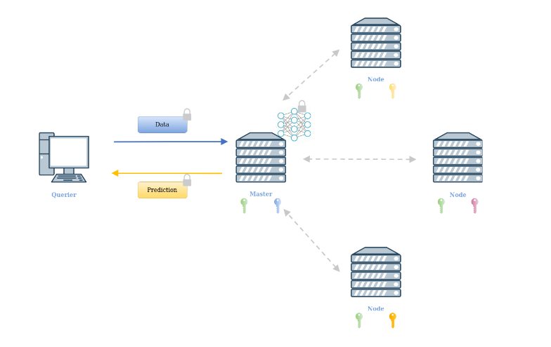

## Documentation

See ```dnn-inference/README.md``` for how to generate the json files needed.
Use ```help.sh``` to spawn the documentation on your browser
If the script does not work, make sure you have godoc installed.
The page should be open at ```localhost:6060```

## Methods

### Matrix Multiplication
The algorithm
simply consists in evaluating the matrix multiplication between
a transposed input in row-major order and a weight matrix
in diagonal order: every diagonal is multiplied elementwise with a 
rotated version of the input ciphertext.
The algorithm is very efficient, as it use hoisted rotations.
Moreover, it produces an output which is fully compatible with subsequent multiplication, with no need for repacking.


### Input packing
It follows from the matrix multiplication:
- each image in batch (a tensor) is row-flattened
- you get a matrix NxD
- matrix is transposed (DxN) and flattened


Additionally, we use the complex trick to get a reduction
in the size of a factor 2. Ciphertext is then replicated by ```replicaFactor```:


### Weight packing
The weight matrix is represented in diagonal form. We use the generalized
diagonals for non-square matrices. Additionally, each element in the diagonals
is replicated a number of times equal to the rows in the input matrix.
We use again the complex trick, where pairs of diagonals are compressed in one.
If the weight matrix has an odd number of rows, the last diagonal carries 0 in the imaginary part 


### Block Matrices
Every matrix is represented in a block representation, i.e
it is splitted in sub-matrices and operations are carried indipendently
between blocks, following regular block matrix arithmetics.
This has 2 benefits:
- allows the encryption/encoding of "big" matrices (which would not fit in the number of slots of the CKKS parameters)
- allows for parallelization, i.e we can perform operations between blocks in a parallel fashion.


As an example, when evaluating a dense or convolutional layers,
the input matrix is splitted in blocks, where each blocks is a 
matrix packed following the input packing approach, whereas the
weight matrix is a block matrix where each block is packed
in the diagonal form. The multiplication algorithm is used to
multiply every block in a parallel fashion.

### Experiments
We tested our framework in 4 experiments, representing 3 scenarios.

#### Scenarios
- Scenario 1: The querier encrypts its data with its own public key,
and sends the data to a server holding the neural network in clear.
Inference is evaluated using HE properties, and the result (encrypted)
is sent back to the querier for decryption.
  

- Scenario 2: In a setup phase, we assume that a cohort of nodes generates
a collective public key and a private key of which each node holds a share.
We assume that the model itself has been trained
by the cohort of nodes under encryption, so to preserve the
confidentiality of each nodes' training data. After training,
the cohort uses the model to perform prediction as a service:
  - the querier encrypts its data under the cohort public key
  - the master node performs the computation. It invokes a distributed bootstrapping
  algorithm if needed.
  - the master node invokes a distributed key switch algorithm
  to switch to obtain a prediction encrypted under the querier's public key
  - prediction is sent back to the querier for decryption

  

- Scenario 3: We assume that in a setup phase, the model owner sends the model,
encrypted, to the client. The client can thus use the model to perform the inference
on its own data (in cleartext!). Finally, the client sends back
the result, masked with a 128 bit random mask, to the model owner, who offers an oblivious decryption service.
  

#### Experiments
- Experiment 1: Evaluation of Cryptonet following scenario 1
- Experiment 2: Evaluation of Cryptonet following scenario 3
- Experiment 3: Evaluation of ZAMA NN50 following scenario 1. Centralized bootstrapping is needed
- Experiment 4: Evaluation of ZAMA NN20 modified to be trained under encryption. Distributed bootstrapping and key switch