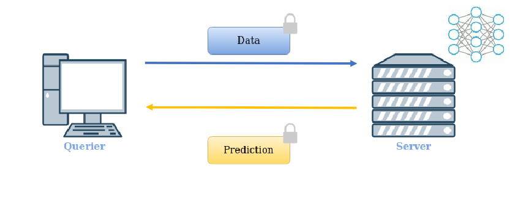

# Documentation
Use ```help.sh``` to spawn the documentation on your browser.
If the script does not work, make sure you have [godoc](https://pkg.go.dev/golang.org/x/tools/cmd/godoc)  and [Python](https://www.python.org/downloads/) installed.
The page should be open at ```localhost:6060```

#### Dependencies
The code has been tested using ```go1.18.3```. To install [Go](https://go.dev/doc/install).

The main library used by the package is [Lattigo](https://github.com/tuneinsight/lattigo).

## Examples
In ```/cryptonet```[1] and ```nn```[2] you can find ```*_test.go``` files that
shows many examples on how to use our framework.

### Tutorial: CryptoNet [1]
Have a look at ```TestCryptonet_EvalBatchEncrypted``` [here](cryptonet/cryptonet_test.go)

#### Defining your own network
Let's have a look at how you can define your own network by looking at some examples:
```
type CNLoader struct {
	network.NetworkLoader
}

type CryptoNet struct {
	network.Network
}

type CryptoNetHE struct {
	*network.HENetwork
}
```
First we define a Loader wrapper for our network and wrapper structs
for the network in cleartext and the encoded/encrypted version for the HE pipeline.
```
func InitActivations(args ...interface{}) []utils.ChebyPolyApprox {
	approx := utils.InitReLU(3)
	return []utils.ChebyPolyApprox{*approx, *approx}
}
```
Now we define a custom method to initiate the activation functions.
In this case it's very simple, all the approximation are degree 3 approximation
of the ReLU function obtained by approximating a smooth version of ReLU.
```
//Taken from nn/nn.go

//Initialize activation function
func InitActivations(args ...interface{}) []utils.ChebyPolyApprox {
	layers := args[0].(int)
	HEtrain := args[1].(bool)
	var suffix string
	var act string
	activations := make([]utils.ChebyPolyApprox, layers)
	if HEtrain {
		suffix = "_poly"
		act = "silu"
	} else {
		suffix = ""
		act = "soft relu"
	}
	jsonFile, err := os.Open(fmt.Sprintf("nn%d%s_intervals.json", layers, suffix))
	utils.ThrowErr(err)
	defer jsonFile.Close()
	byteValue, _ := ioutil.ReadAll(jsonFile)
	var intervals utils.ApproxParams
	json.Unmarshal([]byte(byteValue), &intervals)
	intervals = utils.SetDegOfParam(intervals)
	for i := range intervals.Params {
		interval := intervals.Params[i]
		activations[i] = *utils.InitActivationCheby(act, interval.A, interval.B, interval.Deg)
	}
	return activations
}
```
In this case things get more tricky! What we do here is to load
information about the approximation intervals and degree from some custom ```.json``` files.
Also we use different activations function depending on the model we are loading (NN20 or NN50).

Remember: whatever custom method you code, you should always return
an array of ```utils.ChebyPolyApprox``` to stick with the method signature!
```
func (l *CNLoader) Load(path string, initActivations network.Initiator) network.NetworkI {

	jsonFile, err := os.Open(path)
	utils.ThrowErr(err)
	defer jsonFile.Close()
	byteValue, _ := ioutil.ReadAll(jsonFile)

	nj := new(network.NetworkJ)
	err = json.Unmarshal([]byte(byteValue), nj)
	utils.ThrowErr(err)
	cn := new(CryptoNet)
	cn.SetLayers(nj.Layers)
	activations := initActivations()
	cn.SetActivations(activations)

	return cn
}
```
Finally, here is our custom ```Loader.Load()``` method. The structure is always the same, whatever network you define:
```
cn := new(CryptoNet)
cn.SetLayers(nj.Layers)
activations := initActivations()
cn.SetActivations(activations)
```
First you create a new ```network.Network```, you set the layers
from the json wrapper, you get the activations from your custom ```InitActivations``` method and you
set them in the network with the setter method. That's it!

### Advanced:
Have a look at ```TestCryptonet_EvalBatchClearModelEnc``` [here](cryptonet/cryptonet_test.go)
and to the examples with [NN](nn/nn_test.go) for more advanced usages.

## Methods
Understand how things work under the hood.

### Matrix Multiplication
The algorithm
simply consists in evaluating the matrix multiplication between
a transposed input in row-major order and a weight matrix
in diagonal order: every diagonal is multiplied elementwise with a 
rotated version of the input ciphertext.
The algorithm is very efficient, as it use hoisted rotations.
Moreover, it produces an output which is fully compatible with subsequent multiplication, with no need for repacking.


### Input packing
It follows from the matrix multiplication:
- each image in batch (a tensor) is row-flattened (appending the channels next to each other)
- you get a matrix NxD
- matrix is transposed (DxN) and flattened


Additionally, we use the complex trick to get a reduction
in the size of a factor 2: adjacent columns of the input matrix are compressed in one, exploiting the imaginary part of complex numbers in the slots. Ciphertext is then replicated by ```replicaFactor``` in order to simulate cyclic rotations:


### Weight packing
The weight matrix is represented in diagonal form. We use the generalized
diagonals for non-square matrices. Additionally, each element in the diagonals
is replicated a number of times equal to the rows in the input matrix.
We use again the complex trick, where pairs of diagonals are compressed in one.
If the weight matrix has an odd number of rows, the last diagonal carries 0 in the imaginary part 


### Block Matrices
Every matrix is represented in a block representation, i.e
it is splitted in sub-matrices and operations are carried indipendently
between blocks, following regular block matrix arithmetics.
This has 2 benefits:
- allows the encryption/encoding of "big" matrices (which would not fit in the number of slots of the CKKS parameters)
- allows for parallelization, i.e we can perform operations between blocks in a parallel fashion.


As an example, when evaluating a dense or convolutional layers,
the input matrix is splitted in blocks, where each blocks is a 
matrix packed following the input packing approach, whereas the
weight matrix is a block matrix where each block is packed
in the diagonal form. The multiplication algorithm is used to
multiply every block in a parallel fashion.

### Experiments
We tested our framework in 4 experiments, representing 3 scenarios.

#### Scenarios
- Scenario 1: The querier encrypts its data with its own public key,
and sends the data to a server holding the neural network in clear.
Inference is evaluated using HE properties, and the result (encrypted)
is sent back to the querier for decryption.
  

- Scenario 2: In a setup phase, we assume that a cohort of nodes generates
a collective public key and a private key of which each node holds a share.
We assume that the model itself has been trained
by the cohort of nodes under encryption, so to preserve the
confidentiality of each nodes' training data and of the model itself. After training,
the cohort uses the model to perform oblivious prediction as a service:
  - the querier encrypts its data under the cohort public key
  - the master node performs the computation. It invokes a distributed bootstrapping
  algorithm if needed.
  - the master node invokes a distributed key switch algorithm
  to switch to obtain a prediction encrypted under the querier's public key
  - prediction is sent back to the querier for decryption

  

- Scenario 3: We assume that in a setup phase, the model owner sends the model,
encrypted, to the client. The client can thus use the model to perform the inference
on its own data (in cleartext!). Finally, the client sends back
the result, masked with a 128 bit random mask, to the model owner, who offers an oblivious decryption service.
  

#### Experiments
- Experiment 1: Evaluation of Cryptonet following scenario 1
- Experiment 2: Evaluation of Cryptonet following scenario 3
- Experiment 3: Evaluation of NN50 following scenario 1. Centralized bootstrapping is needed
- Experiment 4: Evaluation of NN20 modified to be trained under encryption. Distributed bootstrapping and key switch

#### Results

##### Hardware Specifications
- 2x Intel Xeon E5-2680 v3, 48 vCPUs
- 16GB DDR4 RAM
##### Network Setting
- Localhost interface wrapped with `latency` go package:
Simulated LAN with 1500B MTU (Ethernet) and 200ms latency
- LAN of EPFL ICCLUSTER
###### How to setup and run on cluster
- Step 0: go to /cluster and populate config.json as needed
- Step 1: run ip_scan.sh -- this will collect the ip addresses of the servers in cluster
- Step 2: run setup.sh -- this will upload the necessary files and configure the servers
- Step 3: before running experiments, run remote.sh -- this will start the servers listening for experiment configuration
- Step 4: upon ending the experiment (if fail), run cleanup.sh -- this will kill the processes holding the ports
##### Experiment 1
##### Experiment 1
| Batch 	| LogN 	| LogQP | Latency(s) 	|
|-------	|------	|------	|------------	|
| 41    	| 14   	| 365   | 5.6        	|

##### Experiment 2 -- localhost
| Batch 	| LogN 	| LogQP | Latency(s) 	  |
|-------	|------	|------	|---------------|
| 41    	| 14   	| 438   | 12.9        	|

##### Experiment 2 -- Cluster LAN
| Batch 	| LogN 	| LogQP | Latency(s) 	  |
|-------	|------	|------	|---------------|
| 41    	| 14   	| 438   | 11.7          |

##### Experiment 3
| Batch 	 | LogN 	| LogQP | Latency(s) 	    |
|---------|--------|------	|-----------------|
| 96    	 | 16    | 1546   | 2298.3        	 |

##### Experiment 4 -- localhost
| Batch 	 | LogN 	 | LogQP | Parties | Latency(s) 	   |
|---------|--------|--------|---------|----------------|
| 48    	 | 15   	 | 874   	 | 10      | 240.7        	 |

##### Experiment 4 -- Cluster LAN
| Batch 	 | LogN 	 | LogQP | Parties | Latency(s) 	   |
|---------|--------|--------|---------|----------------|
| 48    	 | 15   	 | 874   	 | 10      | 226.4        	 |
###### Notes
- Experiment 1 can run in around 4s with batch size = 1
- Experiment 3 shows a loss in accuracy of around 0.2% over 5 iters
- Experiment 4 shows a loss in accuracy of around 0.4% over 5 iters


[1] R. Gilad-Bachrach, N. Dowlin, K. Laine, K. Lauter, M. Naehrig, and J. Wernsing. Cryptonets: Applying neural networks to encrypted data with high throughput and accuracy. In ICML, 2016.

[2] I. Chillotti, M. Joye, and P. Paillier. Programmable bootstrapping enables efficient homomorphic inference of deep neural networks. Cryptology
ePrint Archive, Paper 2021/091, 2021. https://eprint.iacr.org/2021/091.
