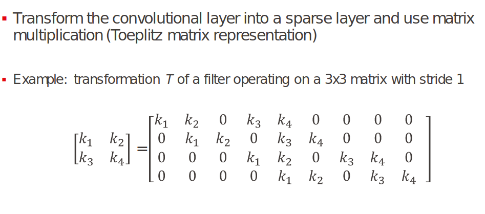
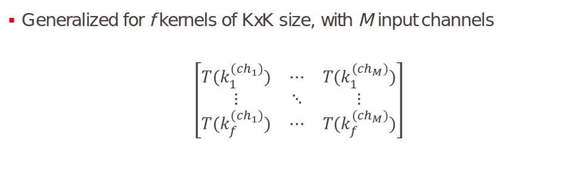

# What is this about
This folder contains python scripts using numpy and pytorch which are used for
training some neural networks used for our test cases. In particular you can
find training scripts for Cryptonet neural network model, as well as
a ```.json``` file with the already trained model parameters. For ZAMA NN we provide the json file with 
the network parameters.
***In any case, you can find all the already trained models as ```.json``` files in ```/models```***

#### Dependencies
The code has been tested using ```Python 3.10```.
All the dependencies can be installed using ```pip install -r requirements.txt```

## Cryptonet
You can run ```python3 cryptonet.py``` to train a new cryptonet model.
After this you should see a ```cryptonet_packed.json``` file in the ```models```
folder. You can copy this to ```inference/cryptonet```

### Data
You can generate the json with MNIST data with ```python3 dataHandler.py --model cryptonet```
and find the file in the ```data``` folder as a ```cryptonet_data_nopad.json```

## NN
You are provided with the json files already generated in ```models/```. Move those into ```inference/nn```, including the ```interval.json``` files.

### Data
Same as cryptonet, use dataHandler with ```--model nn``` and find the
data file ```nn_data.json``` in ```/data```

## Serialization

### Packer
```packing.Packer``` defines a class which exposes the ```Pack()```
method. This is used to generate a format which can be used in the Go module
contained in ```inference```.
```Packer``` takes two methods when initialized, ```serializer``` and ```packer``` which needs to be customly defined by the user.
Under the hood, ```Packer.Pack(net)``` does the following:
```
def Pack(self, net):
    serialized = self.serializer(net)
    return self.packer(serialized)
```
that is first serializes the model (```.pt``` or any other format) in a format that
can be understood by your packer method, and then it packs it for Go inference.
The packer method ***must*** invoke the ```pack_*``` methods in ```packing.py```,
used to create a ```packing.Net``` class and return ```Net.Serialize()```


As an example, have a look at this code to serialize the NN models from ```nn.py```:
```
def serialize_nn(json_data):
    layers = len(json_data['D'])
    serialized = {}
    serialized['conv'] = json_data['conv']
    w = np.array(json_data['conv']['weight']['w']).reshape(json_data['conv']['weight']['kernels'],json_data['conv']['weight']['filters'],json_data['conv']['weight']['rows'],json_data['conv']['weight']['cols'])
    serialized['conv']['weight']['w'] = w.tolist()
    for i in range(layers):
        serialized['dense_'+str(i+1)]=json_data["D"]['dense_'+str(i+1)]
        serialized['dense_'+str(i+1)]['weight']['w'] = np.array(serialized['dense_'+str(i+1)]['weight']['w']).reshape(serialized['dense_'+str(i+1)]['weight']['rows'],serialized['dense_'+str(i+1)]['weight']['cols']).tolist()
   
    serialized['numLayers'] = layers    
    return serialized
```
This is the NN serializer method, which is tailored for our use case, i.e it accepts
a model in a proprietary ```.json``` format and outputs a Python dictionary
for our NN packer method.
```
def pack_nn(serialized):
    # given a serialized representation from read_nn, packs it in json format for Go inference under HE
    # this is an example of packer method
    num_layers = serialized['numLayers']
    num_chans = serialized['conv']['weight']['kernels']
    conv_matrix,_ = pack_conv(np.array(serialized['conv']['weight']['w']),
        serialized['conv']['weight']['rows'],
        serialized['conv']['weight']['cols'],
        1,
        28,28)   
    conv_bias = pack_bias(np.array(serialized['conv']['bias']['b']), num_chans, conv_matrix['cols']//num_chans)
    layers = [Layer(conv_matrix, conv_bias)]
    
    for i in range(num_layers):
        w = np.array(serialized['dense_'+str(i+1)]['weight']['w'])
        layers.append(Layer(
            pack_linear(w),
            pack_bias(serialized['dense_'+str(i+1)]['bias']['b'],
                      serialized['dense_'+str(i+1)]['bias']['cols'],1)))
    
    net = Net(layers, num_layers)
    return net.Serialize()
```
The NN packer method takes the Python Dictionary from the serializer.
Even if the method is customly defined, it has to follow a reference structure.
For each layer (that is, item in the ```serialized``` dictionary), it must invoke the
right ```packing.pack_*``` method, both for weigth and bias of the layer, and
create a ```packing.Layer()``` instance from them:
```
    ...
    conv_matrix,_ = pack_conv(np.array(serialized['conv']['weight']['w']),
        serialized['conv']['weight']['rows'],
        serialized['conv']['weight']['cols'],
        1,
        28,28)   
    conv_bias = pack_bias(np.array(serialized['conv']['bias']['b']), num_chans, conv_matrix['cols']//num_chans)
    layers = [Layer(conv_matrix, conv_bias)]
    ...
```
here we are taking the first layer, that is a convolutional layer, and using the method ```pack_conv``` for the weights and ```pack_bias```
for the bias term. Then we create a layer.

A ```Net``` instance is create simply with a list of layers and the number of layers:
```
net = Net(layers, num_layers)
```
Then we must return ```net.Serialize()```.

### Convolution as Dense layer
Here we provide a graphical sketch of what ```pack_conv```, and the ```gen_kernel_matrix``` that is used internally, do:

```gen_kernel_matrix```


```pack_conv```

